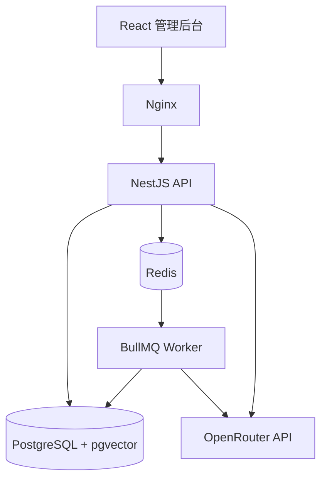
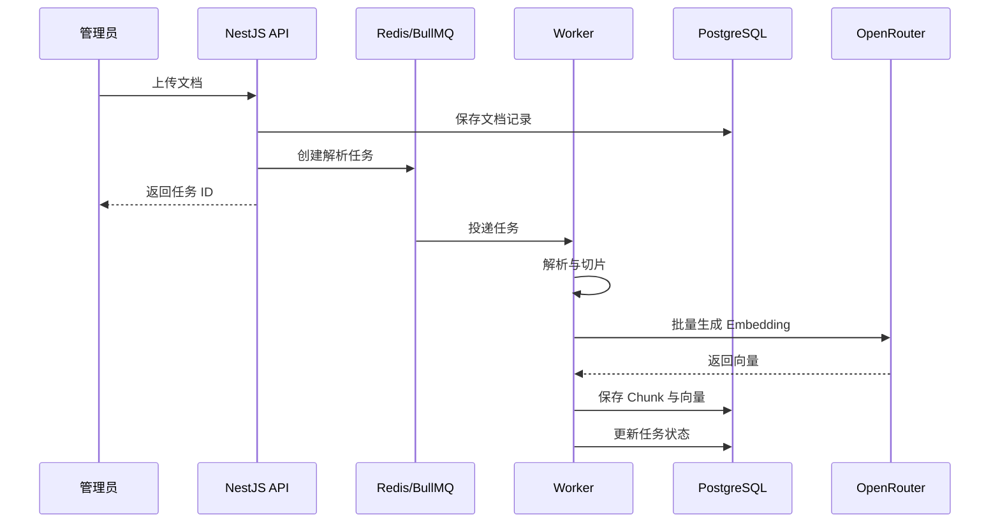
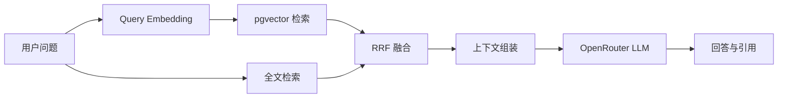
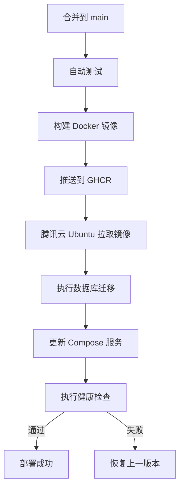

# AI Knowledge Base

一个以 **React + NestJS + PostgreSQL + Redis** 为核心技术栈的 AI 知识库管理后台。

项目目标不只是实现 RAG 知识库功能，还要完整实践一次应用从本地开发到生产交付的 DevOps 流程：

```text
开发应用 → 容器化 → 自动测试 → 自动部署 → 查看日志 → 回滚版本
```

> 当前状态：M3——文档上传与异步任务已完成，准备进入 M4。

开发路线见 [`docs/m1-m9-roadmap.md`](docs/m1-m9-roadmap.md)，阶段文档见 [`docs/m1-setup.md`](docs/m1-setup.md)、[`docs/m2-auth-and-knowledge-bases.md`](docs/m2-auth-and-knowledge-bases.md) 和 [`docs/m3-document-ingestion.md`](docs/m3-document-ingestion.md)。

## 项目目标

本项目面向企业内部知识库管理场景，提供文档上传、异步解析、文本切片、向量化、混合检索和 AI 问答能力。

在业务能力之外，项目还将建设一套可学习、可演示的工程交付链路：

- 使用 Docker 统一本地与生产运行环境
- 使用 GitHub Actions 自动执行检查、测试和构建
- 使用 GitHub Container Registry 管理 Docker 镜像
- 自动部署到腾讯云轻量应用服务器（Ubuntu）
- 通过健康检查发现失败发布
- 使用 Git Commit SHA 标识并回滚应用版本

## 核心功能

### 1. 用户认证

- 管理员登录
- JWT 身份认证
- Redis 管理登录状态或刷新令牌
- 接口与前端路由鉴权
- 初始化管理员账号及修改密码

第一版为单租户后台，不实现开放注册和复杂 RBAC。

### 2. 仪表盘

- 知识库、文档及 Chunk 数量
- 文档处理成功率与失败数量
- 最近文档处理任务
- 最近 AI 问答记录
- PostgreSQL、Redis 和 AI 服务状态

### 3. 知识库管理

- 创建、编辑和删除知识库
- 设置知识库名称、描述和状态
- 配置 Chunk Size、Chunk Overlap
- 配置 TopK 和相似度阈值
- 配置对话模型和 Embedding 模型

### 4. 文档管理

第一版支持以下格式：

- PDF
- Markdown
- TXT

主要能力：

- 上传和删除文档
- 查看文档元数据
- 查看解析与向量化状态
- 查看失败原因并重新处理
- 查看文档产生的 Chunk

文档处理状态：

```text
待处理 → 解析中 → 切片中 → 向量化中 → 已完成
                                  ↓
                                失败
```

### 5. 异步文档处理

文档处理通过 Redis + BullMQ 异步执行：

```text
上传文档
   ↓
NestJS API 创建任务
   ↓
BullMQ 将任务写入 Redis
   ↓
Worker 消费任务
   ↓
解析 → 切片 → Embedding → 写入 PostgreSQL
```

任务需要支持：

- 进度记录
- 失败重试
- 最大重试次数
- 错误原因记录
- 幂等处理
- 重新构建文档索引

### 6. 混合检索测试台

用户输入问题后可以查看完整检索过程：

- 原始 Query
- 向量召回结果
- PostgreSQL 全文检索结果
- RRF 融合排名
- Chunk 相似度与来源文档
- 最终送入大模型的上下文

第一版检索链路：

```text
pgvector 语义检索
        +
PostgreSQL 全文检索
        ↓
      RRF 融合
        ↓
     返回 TopK
```

说明：第一版使用 PostgreSQL 全文检索，不将其描述为标准 BM25。后续如需实现完整 BM25，可扩展 Elasticsearch 或其他检索引擎。

### 7. AI 问答预览

- 选择知识库进行问答
- 流式生成回答
- 展示引用文档和对应 Chunk
- 展示检索耗时和生成耗时
- 相似度不足时拒答
- 保存问答和检索记录

### 8. 日志与审计

- 文档解析日志
- 异步任务执行状态
- AI 请求与错误记录
- 管理后台操作审计
- Docker 容器结构化日志

## 系统架构



### 文档入库链路



### AI 问答链路



## 技术栈

| 领域 | 技术方案 |
| --- | --- |
| 前端 | React、TypeScript、Vite |
| UI | Ant Design |
| 前端状态 | Zustand、TanStack Query |
| 后端 | NestJS、TypeScript |
| ORM | Prisma |
| 数据库 | PostgreSQL |
| 向量检索 | pgvector |
| 缓存与队列 | Redis、BullMQ |
| AI 服务 | OpenRouter、OpenAI-compatible SDK |
| API 文档 | Swagger / OpenAPI |
| 测试 | Vitest、Jest、Supertest |
| 容器化 | Docker、Docker Compose |
| 网关 | Nginx |
| CI/CD | GitHub Actions |
| 镜像仓库 | GitHub Container Registry（GHCR） |
| 部署环境 | 腾讯云轻量应用服务器、Ubuntu |

## 仓库结构

```text
ai-knowledge-base/
├── apps/
│   ├── web/                         # React 管理后台
│   ├── api/                         # NestJS HTTP API
│   └── worker/                      # NestJS BullMQ Worker
├── packages/
│   ├── shared/                      # 共享类型、常量和工具
│   ├── eslint-config/               # ESLint 公共配置
│   └── tsconfig/                    # TypeScript 公共配置
├── prisma/
│   ├── schema.prisma
│   ├── migrations/
│   └── seed.ts
├── deploy/
│   ├── nginx/
│   └── scripts/
│       ├── deploy.sh
│       ├── rollback.sh
│       └── health-check.sh
├── docs/
│   ├── architecture.md
│   ├── deployment.md
│   ├── rollback.md
│   └── interview-notes.md
├── .github/
│   └── workflows/
│       ├── ci.yml
│       ├── deploy.yml
│       └── rollback.yml
├── compose.yml
├── compose.production.yml
├── .env.example
├── pnpm-workspace.yaml
└── README.md
```

## 核心数据模型

| 数据表 | 作用 |
| --- | --- |
| `users` | 管理员账户 |
| `knowledge_bases` | 知识库及检索配置 |
| `documents` | 文档信息和处理状态 |
| `document_chunks` | 文本 Chunk、向量和元数据 |
| `ingestion_jobs` | 文档入库任务及错误信息 |
| `conversations` | AI 问答会话 |
| `messages` | 用户与 AI 消息 |
| `retrieval_records` | 召回结果、分数和耗时 |
| `operation_logs` | 操作审计日志 |

## OpenRouter 集成

项目通过兼容 OpenAI API 的客户端访问 OpenRouter，模型和密钥全部通过环境变量注入，不写入代码或 Docker 镜像。

OpenRouter 同时承担：

- Chat Completion：生成最终回答
- Embeddings：为文档 Chunk 和用户 Query 生成向量

索引和查询必须使用同一个 Embedding 模型，避免产生不兼容的向量空间。

环境变量示例：

```dotenv
OPENROUTER_API_KEY=replace_with_your_key
OPENROUTER_BASE_URL=https://openrouter.ai/api/v1
OPENROUTER_CHAT_MODEL=replace_with_chat_model_id
OPENROUTER_EMBEDDING_MODEL=replace_with_embedding_model_id
```

真实密钥只能配置在本地 `.env`、GitHub Secrets 或服务器环境变量中。

## 本地开发

### 环境要求

- Node.js 24+
- pnpm 11+
- Docker Engine 或 Docker Desktop
- Docker Compose

### 启动方式

复制环境变量：

```bash
cp .env.example .env
```

启动 PostgreSQL 和 Redis：

```bash
docker compose up -d postgres redis
```

安装依赖并初始化数据库：

```bash
pnpm install
pnpm db:migrate
pnpm db:seed
```

启动前端、API 和 Worker：

```bash
pnpm dev
```

本地地址：

| 服务 | 地址 |
| --- | --- |
| React 管理后台 | `http://localhost:5173` |
| NestJS API | `http://localhost:3000` |
| Swagger | `http://localhost:3000/api/docs` |
| 健康检查 | `http://localhost:3000/health` |

## 自动化测试

GitHub Actions 将在 Pull Request 和代码推送时执行：

```text
安装依赖
  ↓
代码规范检查
  ↓
TypeScript 类型检查
  ↓
前端单元测试
  ↓
后端单元测试
  ↓
PostgreSQL / Redis 集成测试
  ↓
API E2E 测试
  ↓
生产构建
```

计划覆盖的核心场景：

- 用户登录成功与失败
- 知识库 CRUD
- 文档类型和大小校验
- 文档任务写入 Redis
- Worker 消费任务并保存 Chunk
- 检索结果包含正确来源
- 健康检查正确反映依赖状态

## 容器化

生产环境包含以下容器：

| 容器 | 作用 |
| --- | --- |
| `web` | React 静态资源 |
| `api` | NestJS HTTP API |
| `worker` | 文档处理与向量化任务 |
| `postgres` | 业务数据、Chunk 和向量 |
| `redis` | 缓存和 BullMQ 队列 |
| `nginx` | 静态资源、反向代理和统一入口 |

生产环境计划通过以下命令启动：

```bash
docker compose -f compose.production.yml up -d
```

PostgreSQL 数据、Redis 数据和原始文档目录使用独立 Volume。重新创建应用容器时不得删除持久化数据。

## CI/CD 部署流程

`main` 分支更新后执行：



镜像使用 Git Commit SHA 作为不可变版本号，例如：

```text
ghcr.io/<github-user>/ai-knowledge-base-web:a8f92c1
ghcr.io/<github-user>/ai-knowledge-base-api:a8f92c1
ghcr.io/<github-user>/ai-knowledge-base-worker:a8f92c1
```

`latest` 只作为方便识别的浮动标签，部署与回滚不能仅依赖 `latest`。

## 生产环境日志

查看所有服务状态：

```bash
docker compose -f compose.production.yml ps
```

持续查看 API 日志：

```bash
docker compose -f compose.production.yml logs -f api
```

查看 Worker 最近 100 行日志：

```bash
docker compose -f compose.production.yml logs --tail=100 worker
```

查看容器资源占用：

```bash
docker stats
```

应用日志将使用结构化 JSON，并包含请求 ID、任务 ID、知识库 ID 和文档 ID，便于串联排查完整调用链。

## 版本回滚

项目支持两种回滚方式：

1. 部署健康检查失败时恢复上一版本。
2. 通过 GitHub Actions 手动输入 Git Commit SHA，回滚到指定镜像版本。

```text
选择目标 Git SHA
  ↓
验证目标镜像存在
  ↓
更新应用镜像版本
  ↓
重新启动应用容器
  ↓
执行健康检查
  ↓
确认回滚结果
```

应用回滚与数据库回滚是不同问题。数据库迁移将优先采用向前兼容方式，避免旧版本应用因数据库结构已发生破坏性变化而无法启动。

## 安全约束

- 不向 Git 提交 `.env`
- 不在代码和 Dockerfile 中写入密钥
- OpenRouter API Key 使用环境变量注入
- 服务器 SSH 私钥保存在 GitHub Secrets
- PostgreSQL 和 Redis 不直接暴露到公网
- 生产环境只开放 HTTP/HTTPS 和必要的 SSH 端口
- 上传文件校验格式、大小和文件名
- 日志不得输出密码、Token 和 API Key

## 开发路线

| 里程碑 | 交付内容 | 状态 |
| --- | --- | --- |
| M0 | 需求、架构和 DevOps 方案 | ✅ 已完成 |
| M1 | Monorepo、React、NestJS、PostgreSQL、Redis | ✅ 已完成 |
| M2 | 登录、知识库 CRUD | ✅ 已完成 |
| M3 | 文档上传、Redis 队列、Worker | ✅ 已完成 |
| M4 | 文档切片、Embedding、pgvector | ⬜ 未开始 |
| M5 | 混合检索与 AI 问答 | ⬜ 未开始 |
| M6 | 单元测试、集成测试、E2E 测试 | ⬜ 未开始 |
| M7 | Dockerfile 与生产 Compose | ⬜ 未开始 |
| M8 | GitHub Actions、GHCR、腾讯云自动部署 | ⬜ 未开始 |
| M9 | 日志排查、故障演练、版本回滚 | ⬜ 未开始 |

## 最终验收标准

- [ ] Docker Compose 一键启动本地环境
- [ ] 完成管理员登录与接口鉴权
- [ ] 支持 PDF、Markdown、TXT 上传与解析
- [ ] 文档通过 Redis + BullMQ 异步处理
- [ ] Chunk 与向量正确写入 PostgreSQL
- [ ] 支持语义检索、全文检索和 RRF 融合
- [ ] AI 回答能够展示引用来源
- [ ] Pull Request 自动执行测试
- [ ] 合并 `main` 后自动构建和部署
- [ ] 可以查看 API、Worker 和部署日志
- [ ] 健康检查失败时停止错误发布
- [ ] 可以指定 Git SHA 回滚应用
- [ ] 仓库和镜像中不存在明文密钥

## 学习目标

完成项目后，应能够独立解释并实践：

- 一个 React + NestJS 全栈项目如何组织
- PostgreSQL 如何同时承载业务数据和向量数据
- Redis 在缓存、登录状态和任务队列中的不同作用
- 为什么耗时的文档处理需要异步 Worker
- Docker 镜像、容器、网络和 Volume 的关系
- CI 与 CD 分别解决什么问题
- GitHub Actions 如何构建并发布镜像
- 云服务器如何拉取镜像并更新应用
- 如何通过日志定位接口和异步任务故障
- 为什么应用回滚不能等同于数据库回滚

## License

本项目计划使用 MIT License。
